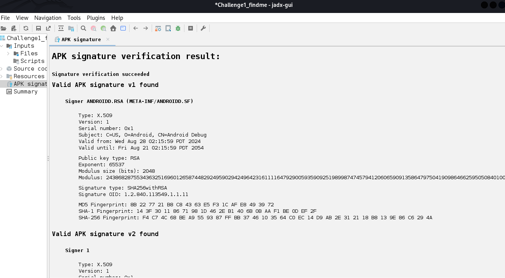
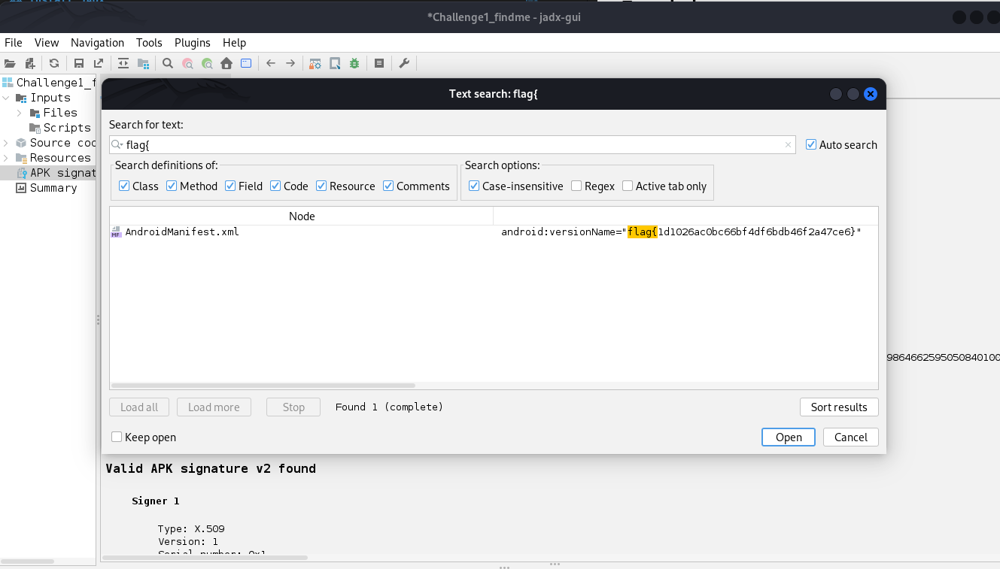
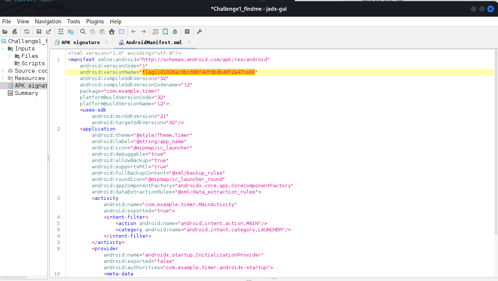

# Mobile / Challenge 1
**NCSA CTF Bootcamp 2024**
**Mobile**
**Challenge 1**
## Step 1 : see what file we got

See that we got file [Challenge1_findme.zip](Challenge1_findme.zip) which is protected zip (password require) the password was provided during NCSA Bootcamp but we didn't make a copy so we will provide unziped file [here](Challenge1_findme.apk)
*edit: we recover password: P@ssw0rd#!
## Step 2: get the right tool
see that the file is .apk which is andriod application file so we wanted to use JADX tools that will decomplie dex to java 

## Install JADX:
### For Linux
1.install jdx dev kit [here](https://www.oracle.com/java/technologies/downloads/#jdk21-linux)<br>
2.run below code in terminal
```
git clone https://github.com/skylot/jadx.git
cd jadx
./gradlew dist
```
3.run program
```
cd build/jadx/bin
./jadx-gui
```

### For window
you can manully install [here](https://github.com/skylot/jadx/releases) 

## Step 3: decomplie dex to java
1. run ./jadx.gui in terminal to open jadx program
2. open challenge1_findme.apk  <br><br>
3. since we know flag format **flag{md5()}** we can try directly search string from bulid-in search funtion  <br><br>
4. double click the chioce and copy the flag 

The flag is **flag{1d1026ac0bc66bf4df6bdb46f2a47ce6}**

Thai version coming soon
written by [slowyier](https://github.com/nolgg)