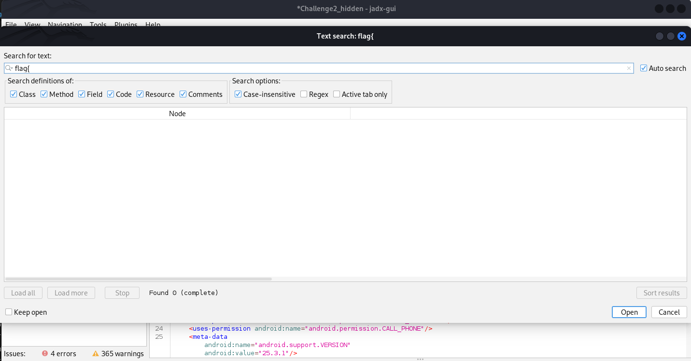

# Mobile / Challenge 2
**NCSA CTF Bootcamp 2024**
**Mobile**
**Challenge 2**
## Step 1: ดูว่าเราได้อะไรมา
จากโจทย์เขาได้ให้ [Challenge2_hidden.zip](Challenge2_hidden.zip) เมื่อแตกไฟล์ด้วยรหัส P@ssw0rd#! จะได้ไฟล์ [Challenge2_hidden.apk](Challenge2_hidden.apk) 
## Step 2: เลือกเครื่องมือ
เมื่อได้ไฟล์ .apk มาข้างในจะเป็น java แบบคอมไพล์มาแล้วเรียกว่า DEX ซึ่งเราไม่สามารถอ่านตรงๆได้ เราต้องใช้โปรแกรม jadx ในการดีคอมไพล์มันกลับมาให้เราสามารถอ่านและวิเคราะห์การทำงานได้
การติดตั้ง jadx:

## Install JADX:
### For Linux
1.install jdx dev kit [here](https://www.oracle.com/java/technologies/downloads/#jdk21-linux)<br>
2.run below code in terminal
```
git clone https://github.com/skylot/jadx.git
cd jadx
./gradlew dist
```
3.run program
```
cd build/jadx/bin
./jadx-gui
```

### For window
you can manully install [here](https://github.com/skylot/jadx/releases) 
<br>
## Step 3: ดีคอมไพล์
หลังจากรันโปรแกรม jadx-gui แล้ว ให้เปิดไฟล์ [Challenge2_hidden.apk](Challenge2_hidden.apk) เพื่อดีคอมไพล์ และหลังจากนั้นจะเห็นหน้านี้ซึ่งสามารถดูไฟล์ต่างๆในแอปพลิเคชั่นได้ <br>


## Step 4: หา flag
1. เมื่อลองค้นหาจาก flag format ดูแล้ว (flag format: **flag{md5()}**) ในฟังชั่น text search ก็ไม่เจออะไร <br> 

<br> 
2. ลองดูว่าในไฟล์มีอะไรน่าสนใจบ้าง <br>

3. เมื่อลองเปิด folder assets ดูจะพบไฟล์ flag.txt <br>
 <br>
4. นำไปถอดรหัสด้วย base64 ในเว็บไซต์ถอดรหัส [CyberChef](https://gchq.github.io/CyberChef) <br>

<br>

ก็จะได้ flag ออกมาคือ **flag{410b8e2da11eb2fb2c6ca1252a694ad7}**

*written by [slowyier](https://github.com/nolgg)*