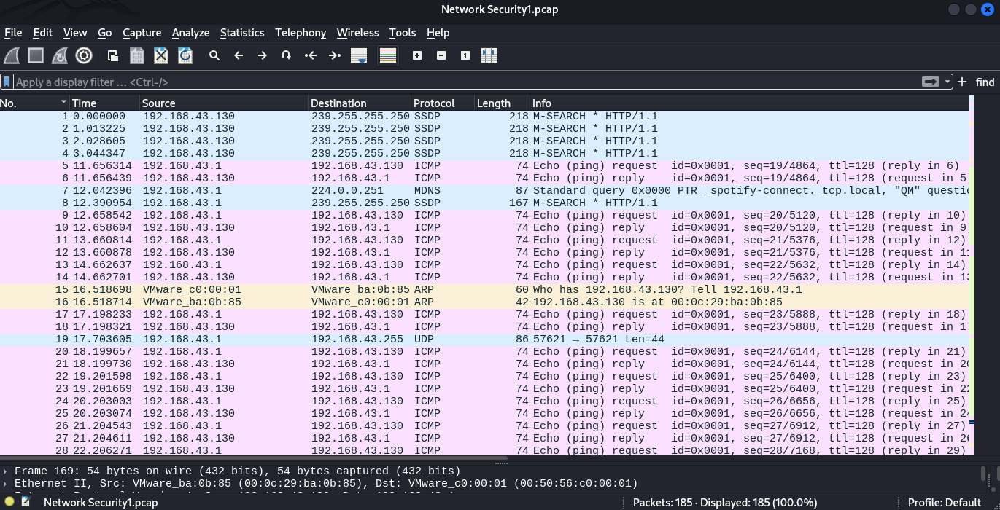
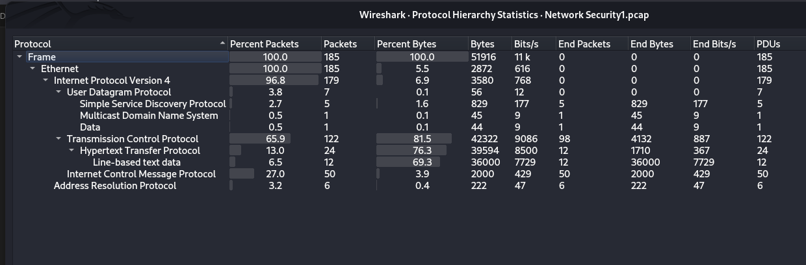
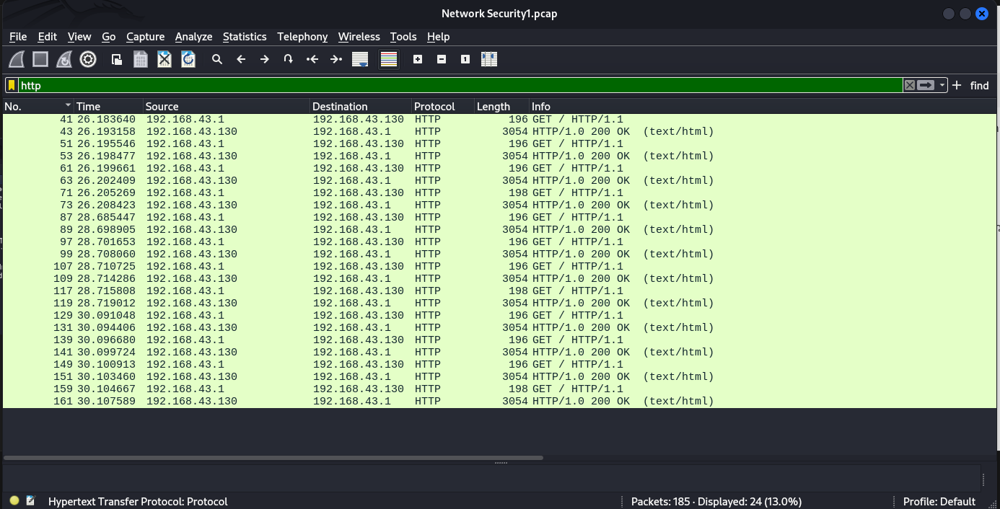
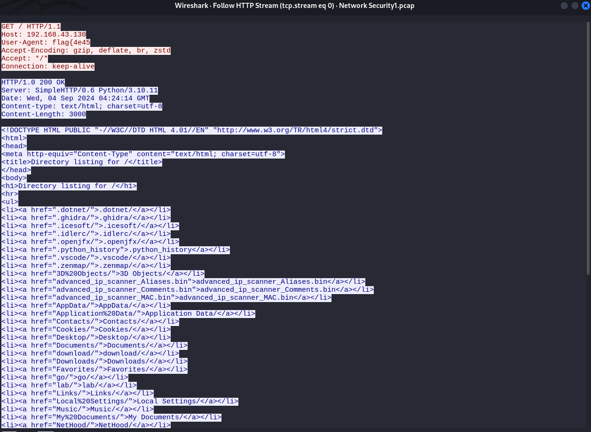
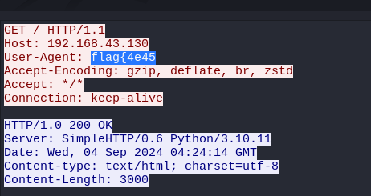
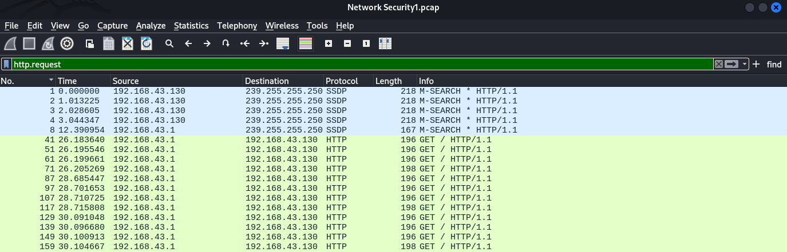
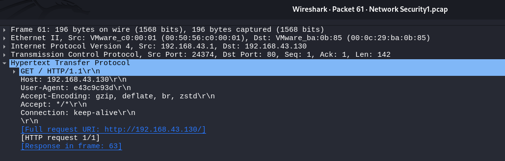
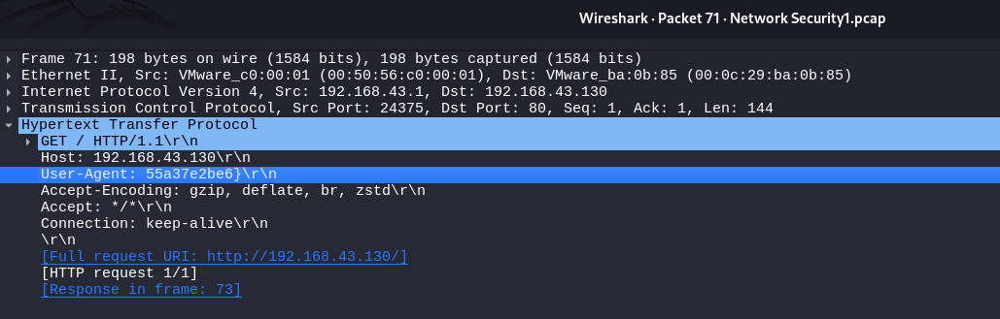

# NetworkSecurity / Challenge 1
**NCSA CTF Bootcamp 2024**
**NetworkSecurity**
**Challenge 1**
## Step 1 : ดูว่าเราได้อะไรมา
จากโจทย์ได้ให้ไฟล์ [NetworkSecurity1.zip](NetworkSecurity1.zip) แตกซิปด้วย unzip
```
unzip NetworkSecurity1.zip
```
หลังจากนั้นจะได้ไฟล์ NetworkSecurity1.pcap มาซึ่ง pcap คือไฟล์ที่เก็บ package จากการวิ่งของ Network ซึ่งมีข้อมูล/ประวัติการวิ่งจำนวนมาก
## Step 1 : เปิด/วิเคราะห์ ไฟล์ pcap
เราจะเปิดไฟล์ pcap ด้วยโปรแกรม wireshark ซึ่งจะติดมากับ kali linux เป็น build-in ส่วนใน window ไปที่ [หน้าเว็บดาวน์โหลด Wireshark](https://www.wireshark.org/download.html) และเลือกตัวติดตั้ง Windows ที่เหมาะสม (32-bit หรือ 64-bit)
- หลังจากเปิดโปรแกรม wireshark เลือกเปิดไฟล์ NetworkSecurity1.pcap <br><br>   <br><br> 

- ดูสถิติว่าส่วนใหญ่เส้นทางวิ่งนี้ใช้ protocol อะไรบ้าง <br><br>  <br><br>
- จะเห็นว่าส่วนใหญ่ใช้ Hypertext Tranfer Protocol หรือ http หลังจากนั้นลองกรอง package ด้วย http ดู <br><br>  <br><br>
- เมื่อลอง follow http stream (คลิกขวา > follow > http stream) จะเห็นได้ว่ามีส่วนหนึ่งของ flag อยู่ที่ User-agent <br><br>  <br><br>  <br><br>
- หาส่วนถัดไปด้วยการกรองเอาแค่ http request ด้วย http.request<br><br>  <br><br>
- และเข้าไปดูใน package แต่ละอัน <br><br>    <br><br> 
- การก็อปปี้ค่าภายในทำได้โดยการ คลิกขวา > copy > value


เมื่อนำมาเรียงกันก็จะได้ flag คือ **flag{4e45dcb90799fe43c9c93d55a37e2be6}** <br>
*written by [slowyier](https://github.com/nolgg)*


