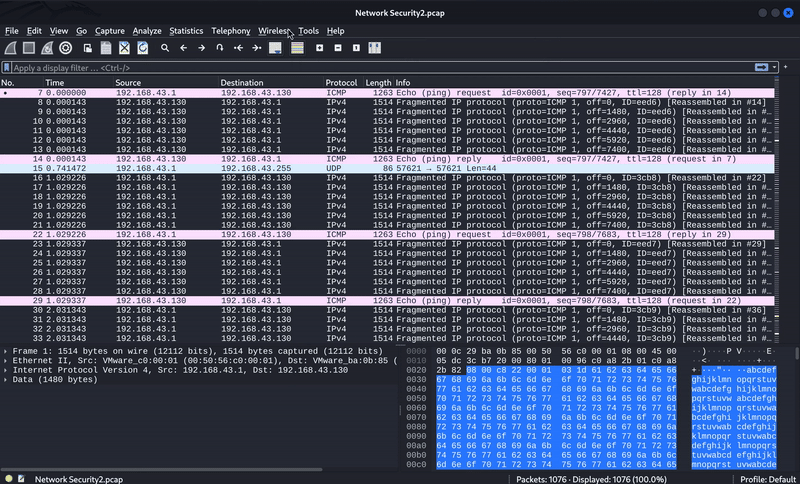
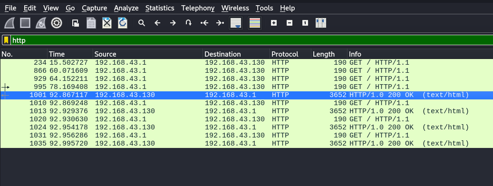
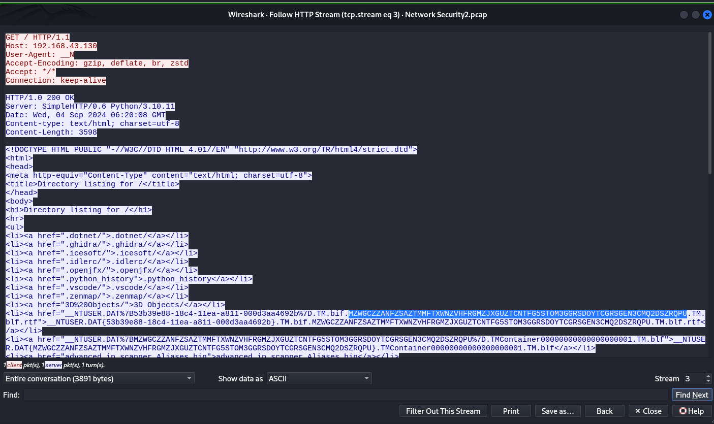
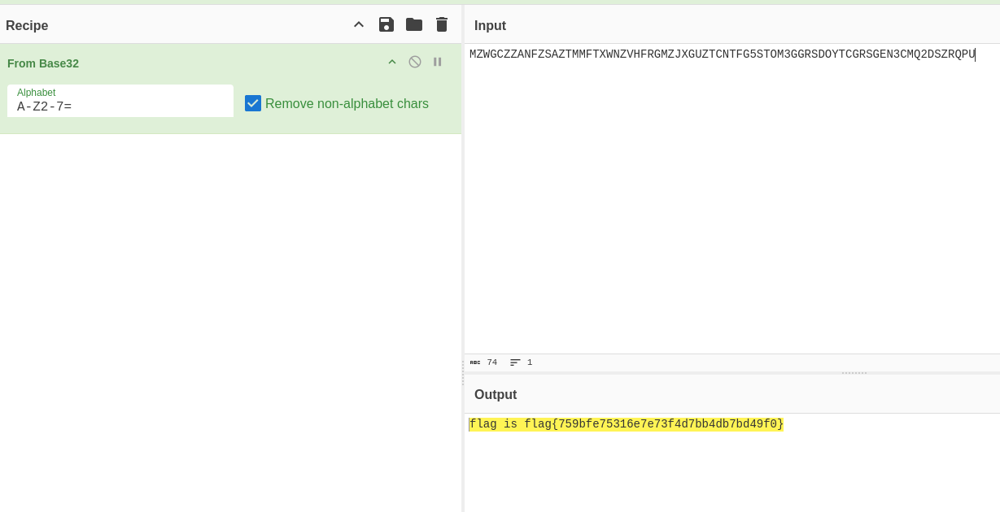

# NetworkSecurity / Challenge 2
<br>**NCSA CTF Bootcamp 2024**</br>
<br>**NetworkSecurity**</br>
<br>**Challenge 1**</br>
## Step 1 :
ดาวโหลดไฟล์ [<u>NetworkSecurity2.zip</u>](https://github.com/KUBits-802/NCSA-CTF-Boot-Camp-2024/raw/main/Network/ch2/NetworkSecurity2.zip) จากนั้นจะทำการแตกไฟล์ด้วยคำสั่ง "unzip <file_name>"
```
┌──(kali㉿kali)-[~/Downloads/Network]
└─$ unzip NetworkSecurity2.zip 
Archive:  NetworkSecurity2.zip
  inflating: Network Security2.pcap
```
เราก็จะได้ไฟล์ [**packet capture**](https://www.solarwinds.com/resources/it-glossary/pcap) ออกมา ซึ่งเราจะนำไฟล์นี้ไปวิเคราะห์ในขั้นตอนถัดไป
## Step 2 :
ในขั้นตอนนี้เราจำเป็นที่จะต้องใช้โปรแกรม [<br>wireshark</br>](https://www.wireshark.org/download.html) ในการวิเคราะห์ข้อมูลภายในไฟล์ เมื่อดาวโหลดตัวโปรแกรมแล้วให้ทำการเปิดไฟล์ที่เราต้องการจะวิเคราะห์



- จะเห็นได้ว่ามีการเรียก http อยู่จำนวนหนึ่งซึ่งเป็นข้อมูลที่เราสามารถอ่านได้ ลองกรองเอาแค่ http ออกมาด้วย > http <br><br>  <br> <br>
- ลองตามไปดูว่ามันทำอะไรด้วยคลิกขวา follow > http stream จะได้ออกมาหน้าตา <br><br>  <br> <br>
- สังเกตุข้อมูลยาวผิดปกติได้คือ 
```
  MZWGCZZANFZSAZTMMFTXWNZVHFRGMZJXGUZTCNTFG5STOM3GGRSDOYTCGRSGEN3CMQ2DSZRQPU 
```
- เมิ่อนำไป Decode ด้วย base32  ที่ [cyberchef](https://gchq.github.io/CyberChef/) ก็จะได้คำตอบออกมา <br> <br>  <br> <br>

ดั้งนั้น flag คือ  **flag{759bfe75316e7e73f4d7bb4db7bd49f0}**

*written by [slowyier](https://github.com/nolgg) and [mos](https:/chicken.com)* 

