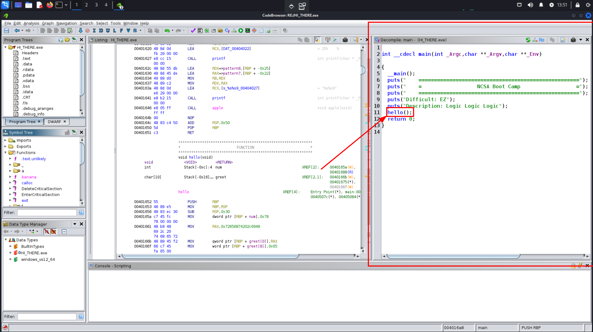
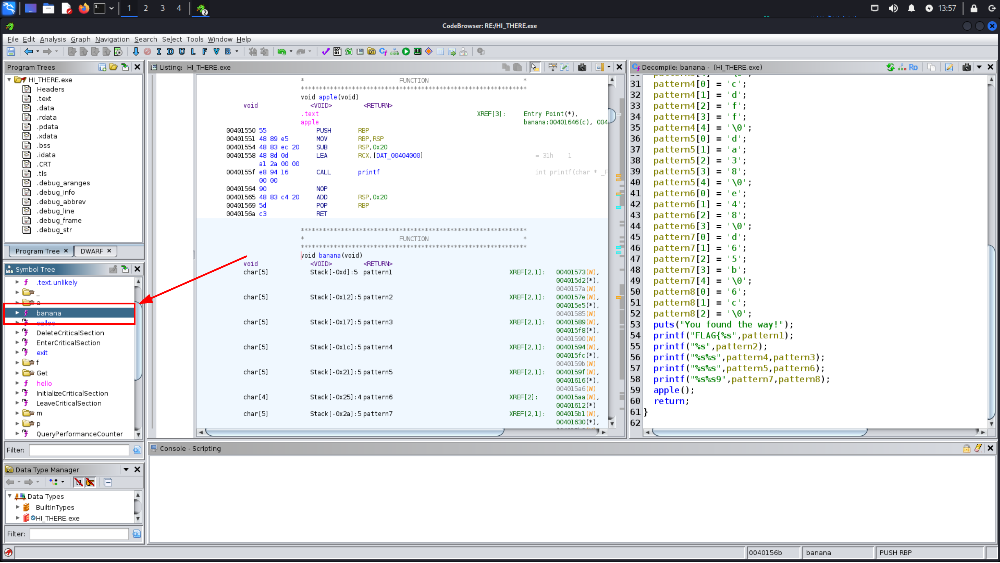
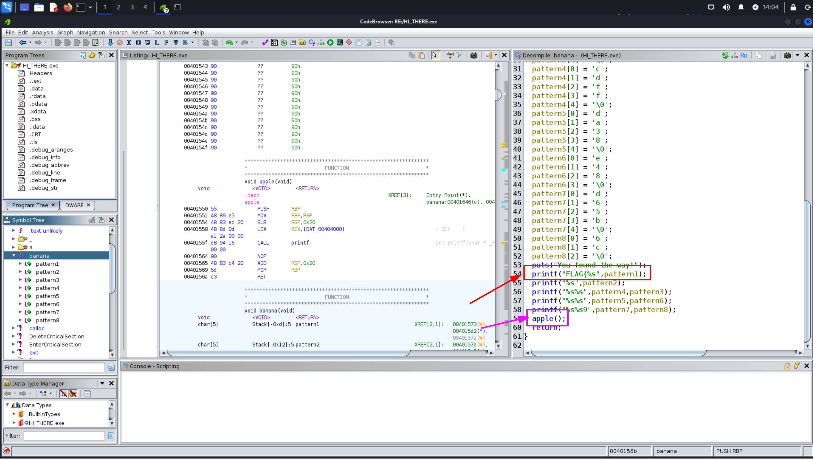

# RE / Challenge 1
**NCSA CTF Bootcamp 2024**<br/>
**RE**<br/>
**Challenge 1**
## Step 1:
unzip ไฟล์ challenge
```bash
[siph:~/Documents/CTF_COPY/RE/ch1]$ unzip HI_THERE.zip
Archive:  HI_THERE.zip
  inflating: HI_THERE.exe
```

## Step 2:
เมื่อแตกไฟล์จะเห็นว่ามีไฟล์ exe เราจะใช้ [ghidra](https://github.com/NationalSecurityAgency/ghidra) ในการ decompile


เมื่อเราโยนเข้า ghidra จะเห็น code ที่ decompile มาแล้วจะเห็นว่า main เรียก hello() อีกทีนึงเราจะลองเข้าไปดูใน hello()

flag ไม่น่าจะอยู่ใน hello()

## Step 3:
ผมเลยลองดู function อื่น ผมไปเจอกับ function ที่ชื่อ banana() เลยลองกดเข้าไปดู


ผมเลยลองกดใน banana()



ใน function banana จะเรียก apple() ผมเลยเข้าไปดูใน apple() อีกที


ผมเลยเอา apple กับ banana มารวมกัน

```c
// main.c
#include <stdio.h>

void apple(void) {
  printf("13}");
  return;
}

void banana(void) {
  char pattern8[3];
  char pattern7[5];
  char pattern6[4];
  char pattern5[5];
  char pattern4[5];
  char pattern3[5];
  char pattern2[5];
  char pattern1[5];

  pattern1[0] = '7';
  pattern1[1] = 'c';
  pattern1[2] = 'a';
  pattern1[3] = '4';
  pattern1[4] = '\0';
  pattern2[0] = '7';
  pattern2[1] = '9';
  pattern2[2] = '3';
  pattern2[3] = 'd';
  pattern2[4] = '\0';
  pattern3[0] = '4';
  pattern3[1] = '6';
  pattern3[2] = 'e';
  pattern3[3] = 'c';
  pattern3[4] = '\0';
  pattern4[0] = 'c';
  pattern4[1] = 'd';
  pattern4[2] = 'f';
  pattern4[3] = 'f';
  pattern4[4] = '\0';
  pattern5[0] = 'd';
  pattern5[1] = 'a';
  pattern5[2] = '3';
  pattern5[3] = '8';
  pattern5[4] = '\0';
  pattern6[0] = 'e';
  pattern6[1] = '4';
  pattern6[2] = '8';
  pattern6[3] = '\0';
  pattern7[0] = 'd';
  pattern7[1] = '6';
  pattern7[2] = '5';
  pattern7[3] = 'b';
  pattern7[4] = '\0';
  pattern8[0] = '6';
  pattern8[1] = 'c';
  pattern8[2] = '\0';
  puts("You found the way!");
  printf("FLAG{%s", pattern1);
  printf("%s", pattern2);
  printf("%s%s", pattern4, pattern3);
  printf("%s%s", pattern5, pattern6);
  printf("%s%s9", pattern7, pattern8);
  apple();
  return;
}

int main() {
  banana();
  return 0;
}
```

## Step 4:
```bash
[siph:~/Documents/CTF_COPY/RE/ch1]$ gcc main.c
[siph:~/Documents/CTF_COPY/RE/ch1]$ ./a.out
You found the way!
FLAG{7ca4793dcdff46ecda38e48d6[REDACTED]}
```
*written by [Siraphat-ohm](https://github.com/Siraphat-ohm)*