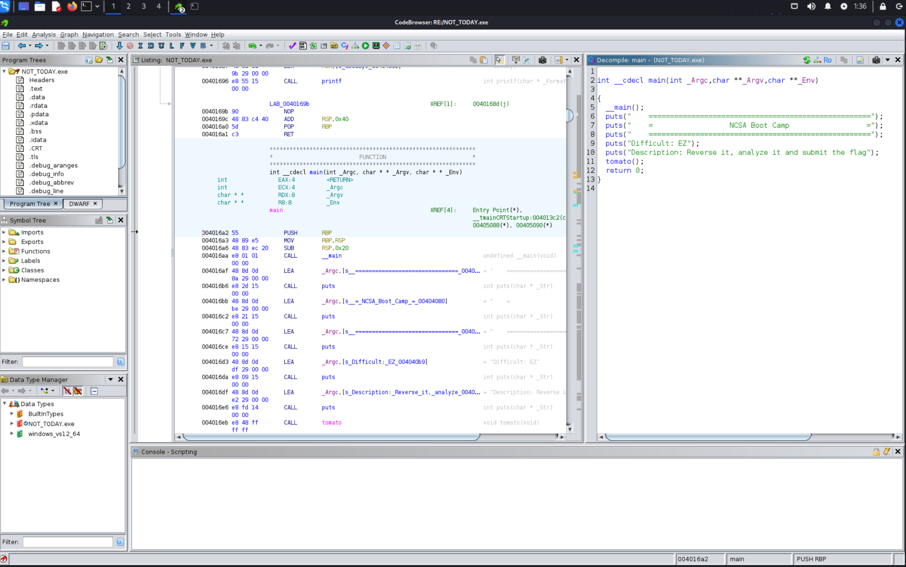
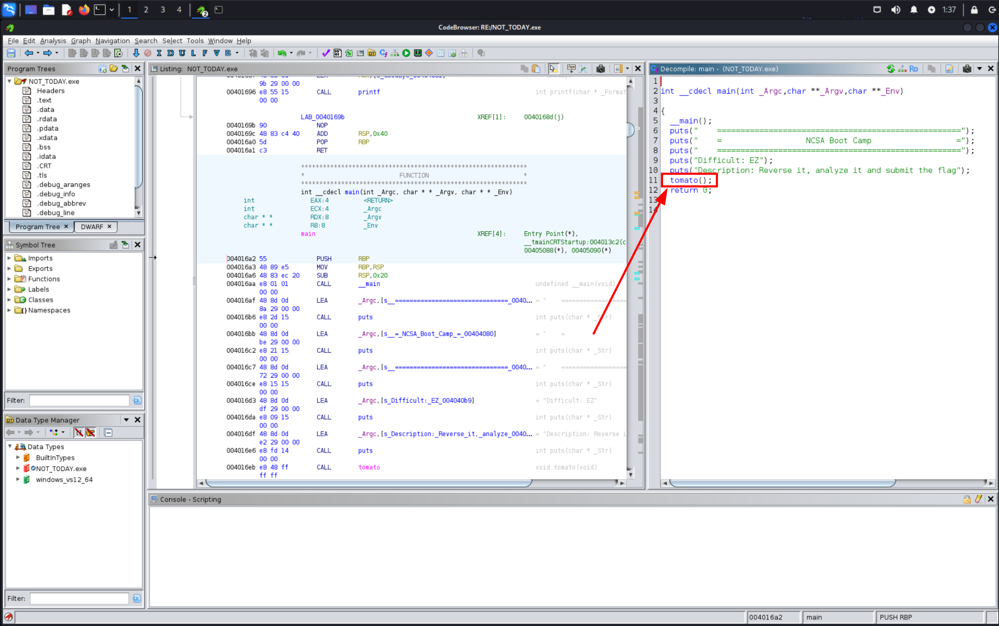
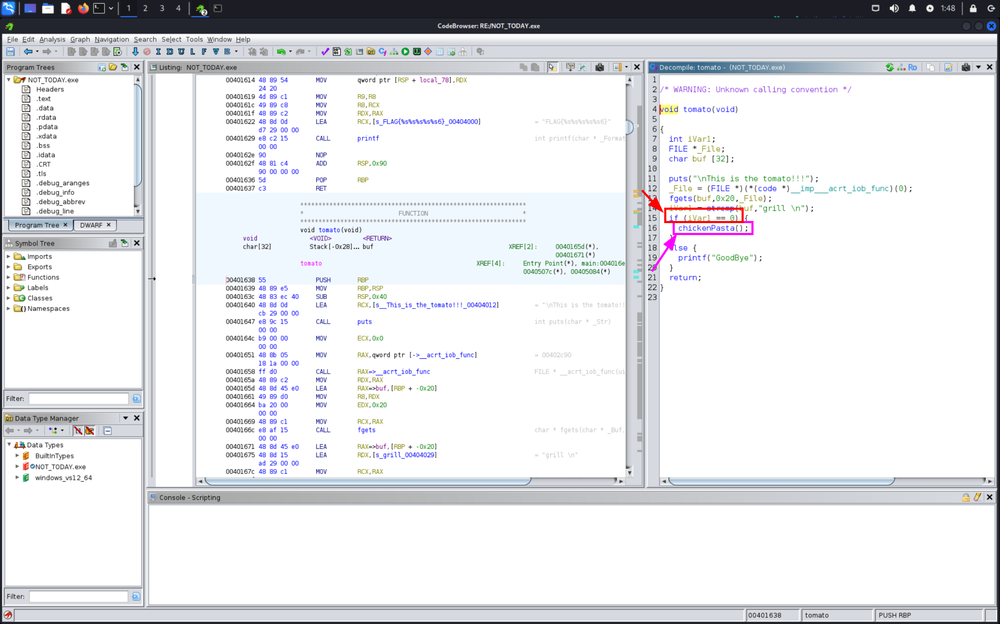
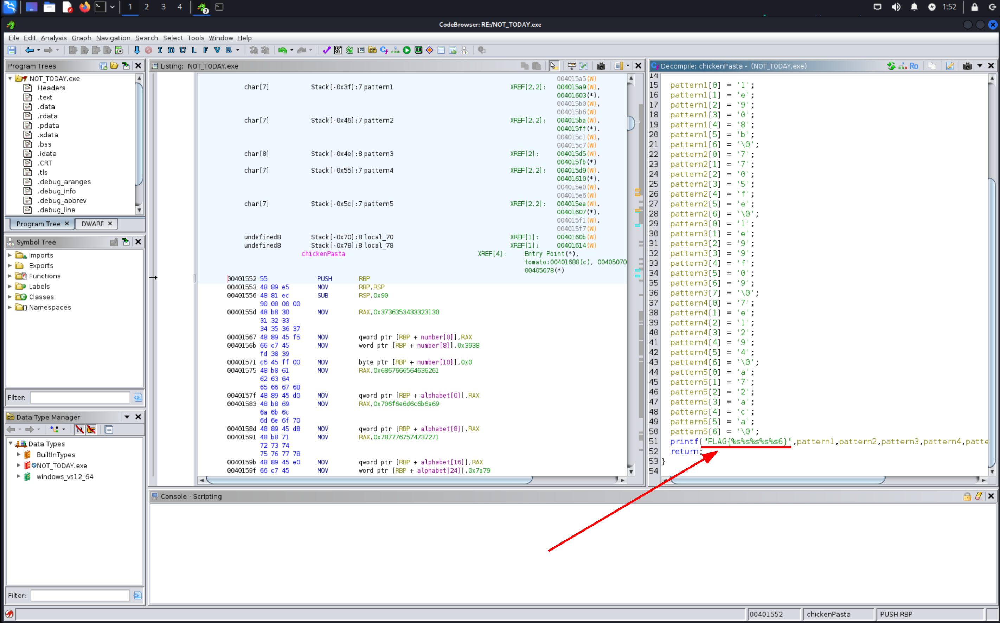
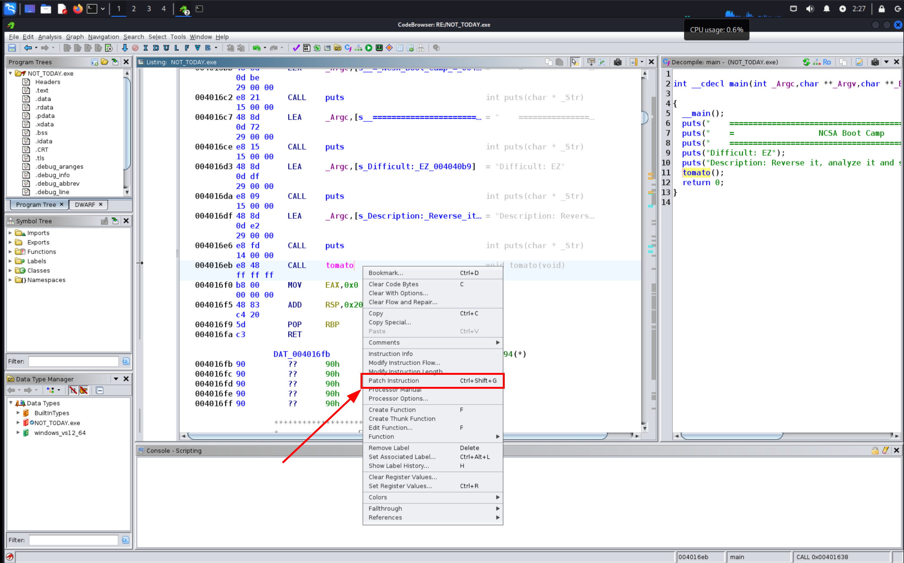
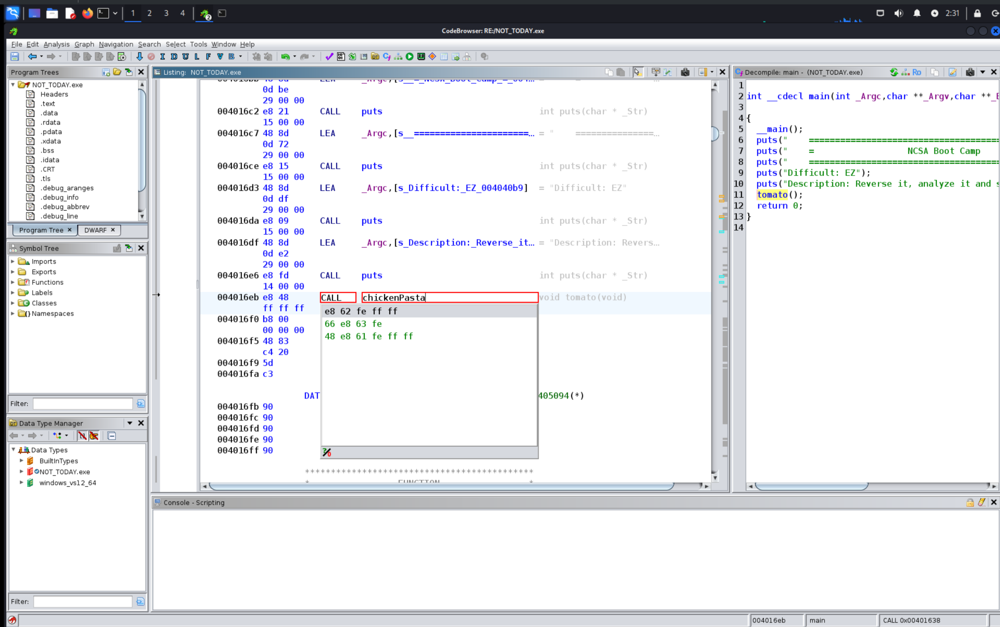
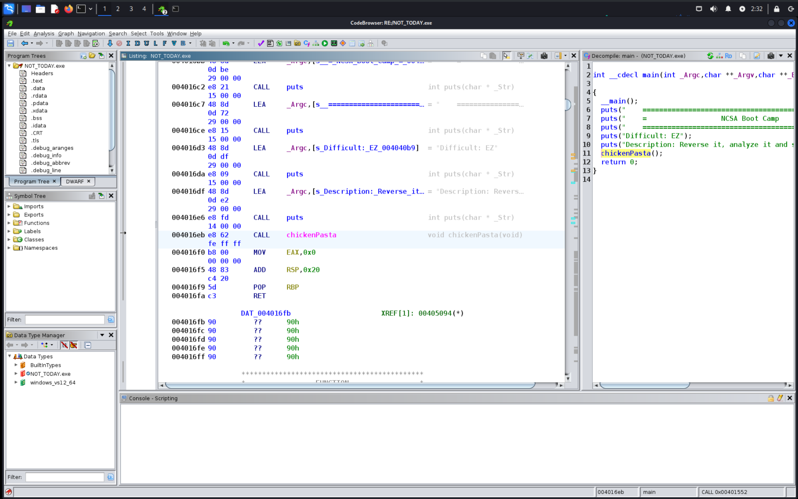
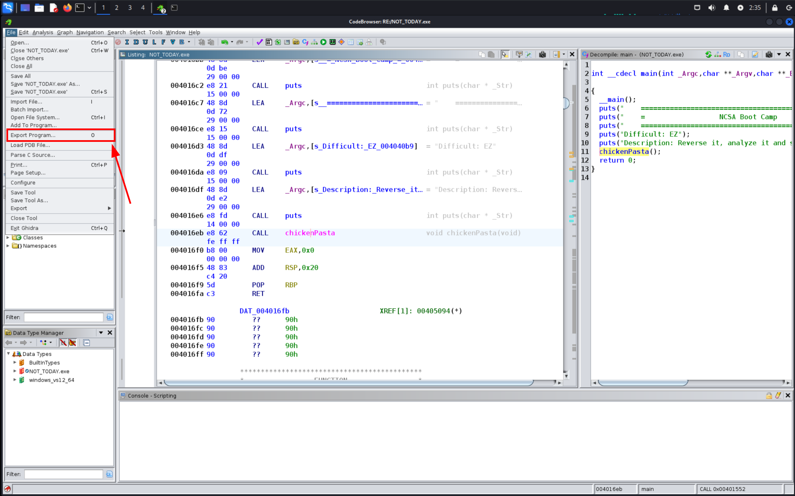
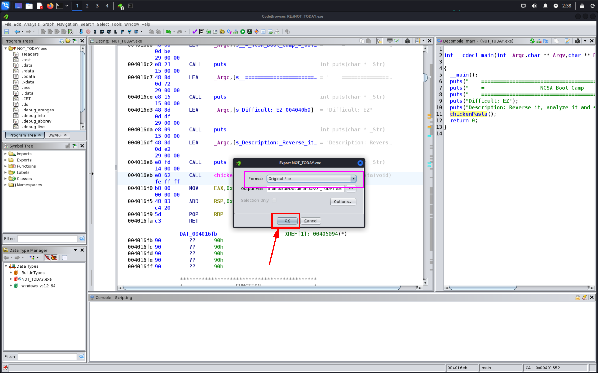

# RE / Challenge 2
**NCSA CTF Bootcamp 2024**<br/>
**RE**<br/>
**Challenge 2**
## Step 1:
unzip ไฟล์ challenge
```bash
[siph:~/Documents/CTF_COPY/RE/ch2]$ unzip NOT_TODAY.zip
Archive:  NOT_TODAY.zip
  inflating: NOT_TODAY.exe
```
## Step 2:
เมื่อแตกไฟล์จะเห็นว่ามีไฟล์ exe เราจะใช้ [ghidra](https://github.com/NationalSecurityAgency/ghidra) ในการ decompile



## Step 3:
ผมจะเข้าไปดูใน tomato



ใน tomato จะเรียก chickenPasta  ผมเลยจะเข้าไปส่องใน chickenPasta ต่อ



จะเห็นได้ว่า chickenPasta จะ print flag อยู่



## Step 4:
ตอนนี้รู้แล้วว่า chickenPasta สามารถ print flag ให้เราได้เราจะทำเหมือน [ch1](../ch1/README.md) ก็ได้แต่รอบนี้ผมอยากลองที่จะ patch insruction 





เมื่อ patch instruction เสร็จแล้ว ผมจะ export ออกมาแล้วเอามา run




เราจะใช้ [wine](https://github.com/wine-mirror/wine) ในการ run ไฟล์ exe

```bash
┌──(kali㉿kali)-[~/Documents]
└─$ wine NOT_TODAY.exe 
    ====================================================
    =                  NCSA Boot Camp                  =
    ====================================================
Difficult: EZ
Description: Reverse it, analyze it and submit the flag
FLAG{1e908b7705fe1e99f097e1294[REDACTED]}
```

*written by [Siraphat-ohm](https://github.com/Siraphat-ohm)*